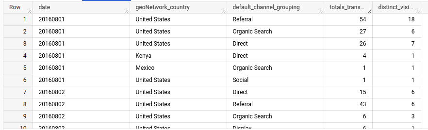

# **Assignment 3**
---
## Assignment Objective:
> From this public table `data-to-insights.ecommerce.rev_transactions`. Create an efficient query which
derives the total transactions per date and country based on the channel grouping! (Don’t forget to
clean the data and bonus point if using repeated columns)
---
### Check the query on Google Bigquery:
> `https://console.cloud.google.com/bigquery?sq=678138110964:620c912d01e241e5b7d63dd2391d4ab6`
---
### Example Result
